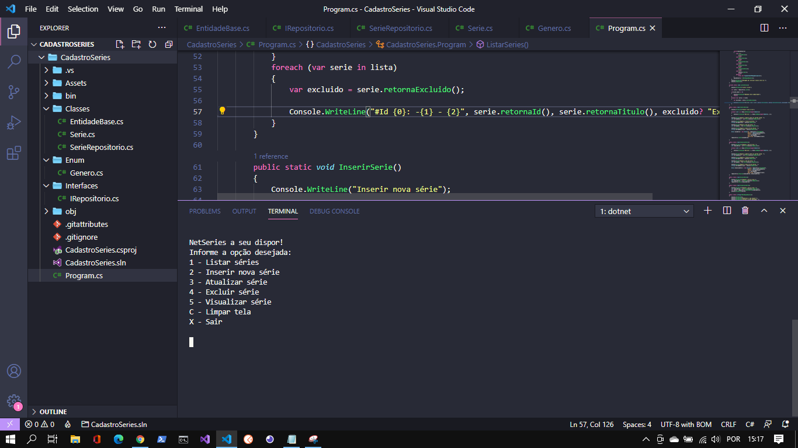

# Cadastro de Séries - POO

  

## Descrição
Essa aplicação console é um sistema que faz o cadastro, exclusão, atualização e listagem de todas séries de tv.
Este sistema foi desenvolvido a nível didático dos paradigmas de orientação a objetos.
Os dados salvos são armazenados apenas em tempo de execução em um List.
Foi implementado o design pattern Repository onde utilizamos uma interface repositorio entre onde separamos a camada de acesso aos dados e a camada de lógica da aplicação.

## Tecnologias Utilizadas
* C#
* Orientação a objetos (Herança, Encapsulamento, Polimorfismo e Abstração)
* Design Pattern Repository

## Como executar
1. Faça o download ou clone este repositório;
1. Abra-o no Visual Studio
1. Faça um rebuild e coloque para executar.
